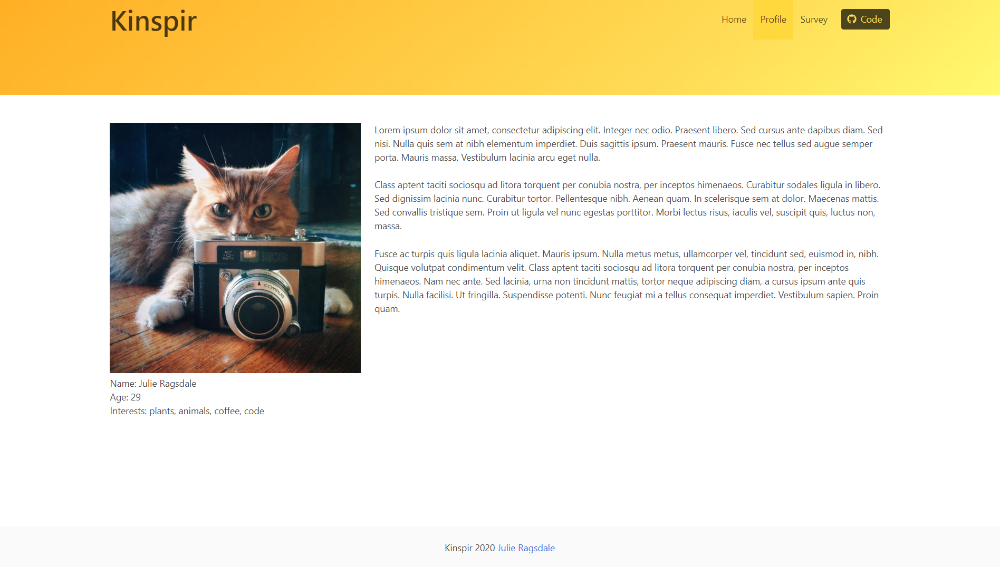

# FriendFinder

Check it out here: https://ragsdale-friendfinder.herokuapp.com/

This application was a fun assignment that I completed during my web development boot camp. It is a platonic matchmaker that uses a very basic algorithm for comparing the user's answers to those of other (fictitious) users. I used a CSS framework, Bulma, for the layout. 

## Screenshots
Below are a few screenshots of the app.

## Improvements
I have several improvements in mind for this project, including: 
- Improve loading time for header image on home page.
- Recreate the survey dynamically, and only show one question at a time. Doing so would feel less overwhelming for the user, as they would only have one task (question) to focus on at a time. This would also look better, as everything would be displayed above the fold. 
- Add a progress bar so that the user can track how much of the survey they have completed.
- Add user authentication.
- Hook the app up to a database and make it more data-driven. It would be nice to store and manage credentials, matches, and survey questions.
- Make the profile page real. Allow users to log in and edit their profile picture and bio. 

## Technology
I built this app using HTML, CSS, jQuery, Node.js, Express, and Bulma.